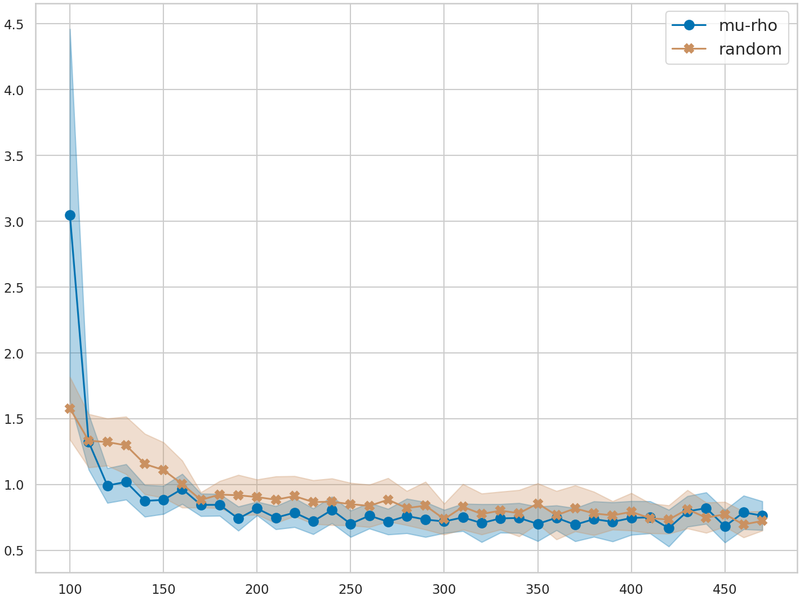
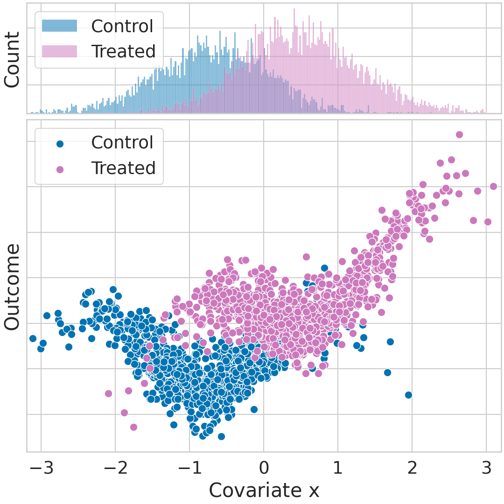
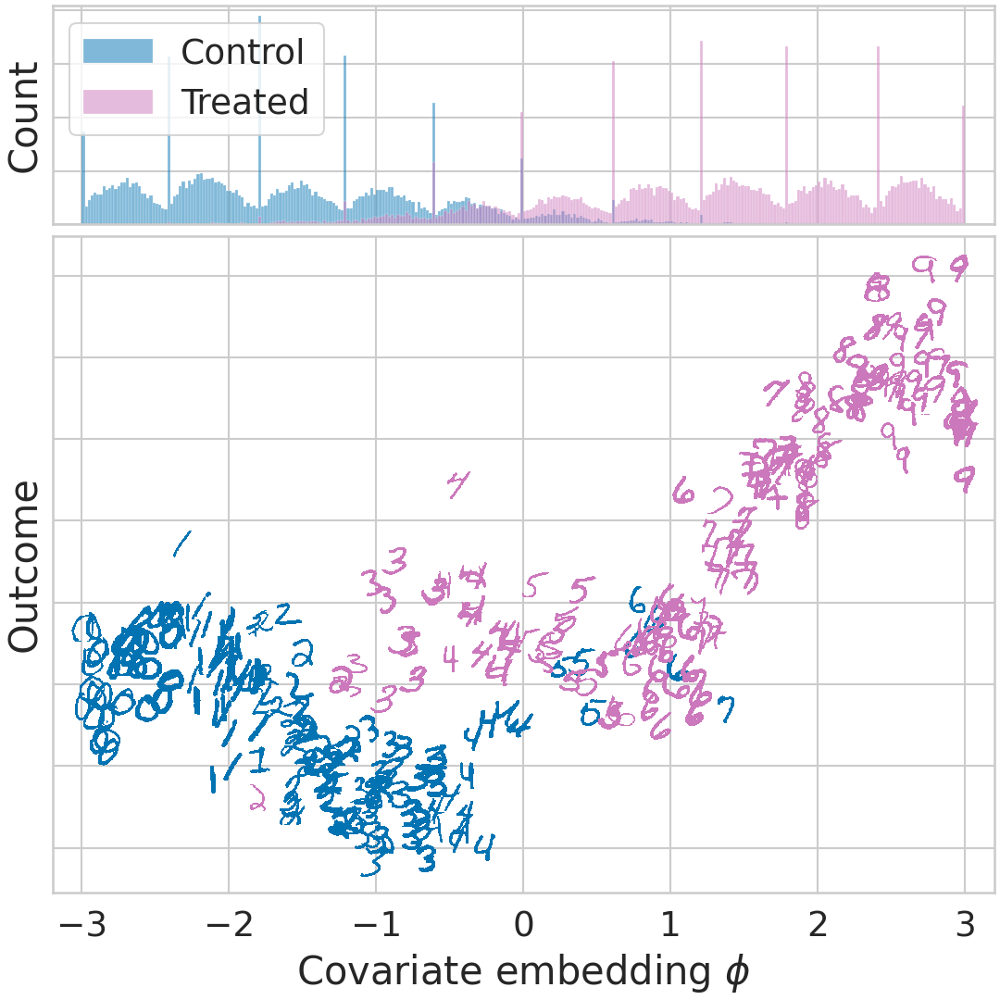

# causal-bald

| **[Abstract](#abstract)**
| **[Installation](#installation)**
| **[Example](#example)**
| **[Citation](#citation)**
| **[Reproducing Results DUE](#reproducing-due)**

An implementation of the methods presented in [Causal-BALD: Deep Bayesian Active Learning of Outcomes to Infer Treatment-Effects from Observational Data](https://arxiv.org/abs/2111.02275).


## Abstract

Estimating personalized treatment effects from high-dimensional observational data is essential in situations where experimental designs are infeasible, unethical or expensive. Existing approaches rely on fitting deep models on outcomes observed for treated and control populations, but when measuring the outcome for an individual is costly (e.g. biopsy) a sample efficient strategy for acquiring outcomes is required. Deep Bayesian active learning provides a framework for efficient data acquisition by selecting points with high uncertainty. However, naive application of existing methods selects training data that is biased toward regions where the treatment effect cannot be identified because there is non-overlapping support between the treated and control populations. To maximize sample efficiency for learning personalized treatment effects, we introduce new acquisition functions grounded in information theory that bias data acquisition towards regions where overlap is satisfied, by combining insights from deep Bayesian active learning and causal inference. We demonstrate the performance of the proposed acquisition strategies on synthetic and semi-synthetic datasets IHDP and CMNIST and their extensions which aim to simulate common dataset biases and pathologies.

## Installation

```.sh
$ git clone git@github.com:[anon]/causal-bald.git
$ cd causal-bald
$ conda env create -f environment.yml
$ conda activate causal-bald
```
[Optional] For developer mode
```.sh
$ pip install -e .
```

## Example

### Active learning loop

First run using random acquisition:

```.sh
causal-bald \
    active-learning \
        --job-dir experiments/ \
        --num-trials 5 \
        --step-size 10 \
        --warm-start-size 100 \
        --max-acquisitions 38 \
        --acquisition-function random \
        --temperature 0.25 \
        --gpu-per-trial 0.2 \
    ihdp \
        --root assets/ \
    deep-kernel-gp
```

Now run using $\mu\rho\textrm{-BALD}$ acquisition.

```.sh
causal-bald \
    active-learning \
        --job-dir experiments/ \
        --num-trials 5 \
        --step-size 10 \
        --warm-start-size 100 \
        --max-acquisitions 38 \
        --acquisition-function mu-rho \
        --temperature 0.25 \
        --gpu-per-trial 0.2 \
    ihdp \
        --root assets/ \
    deep-kernel-gp
```

### Evaluation

Evaluate PEHE at each acquisition step

```.sh
causal-bald \
    evaluate \
        --experiment-dir experiments/active_learning/ss-10_ws-100_ma-38_af-random_temp-0.25/ihdp/deep_kernel_gp/kernel-Matern32_ip-100-dh-200_do-1_dp-3_ns--1.0_dr-0.1_sn-0.95_lr-0.001_bs-100_ep-500/ \
        --output-dir experiments/due/ihdp \
    pehe
```

```.sh
causal-bald \
    evaluate \
        --experiment-dir experiments/active_learning/ss-10_ws-100_ma-38_af-mu-rho_temp-0.25/ihdp/deep_kernel_gp/kernel-Matern32_ip-100-dh-200_do-1_dp-3_ns--1.0_dr-0.1_sn-0.95_lr-0.001_bs-100_ep-500/ \
        --output-dir experiments/due/ihdp \
    pehe
```

Plot results

```.sh
causal-bald \
    evaluate \
        --experiment-dir experiments/due/ihdp \
    plot-convergence \
        -m mu-rho \
        -m random

```



## Citation

If you find this code helpful for your work, please cite our paper
[Paper](https://arxiv.org/abs/2111.02275) as

```bibtex
@article{jesson2021causal,
  title={Causal-BALD: Deep Bayesian Active Learning of Outcomes to Infer Treatment-Effects from Observational Data},
  author={Jesson, Andrew and Tigas, Panagiotis and van Amersfoort, Joost and Kirsch, Andreas and Shalit, Uri and Gal, Yarin},
  journal={Advances in Neural Information Processing Systems},
  volume={35},
  year={2021}
}
```

<h2 id="reproducing-due">Reprodcuing Results Due<h2>

### IHDP

#### $\mu\rho$-BALD

```.sh
causal-bald active-learning --job-dir experiments/ --num-trials 200 --step-size 10 --warm-start-size 100 --max-acquisitions 38 --acquisition-function mu-rho --temperature 0.25 --gpu-per-trial 0.2 ihdp --root assets/ deep-kernel-gp
```

```.sh
causal-bald evaluate --experiment-dir experiments/active_learning/ss-10_ws-100_ma-38_af-mu-rho_temp-0.25/ihdp/deep_kernel_gp/kernel-Matern32_ip-100-dh-200_do-1_dp-3_ns--1.0_dr-0.1_sn-0.95_lr-0.001_bs-100_ep-500/ --output-dir experiments/due/ihdp pehe
```

#### $\mu$-BALD

```.sh
causal-bald active-learning --job-dir experiments/ --num-trials 200 --step-size 10 --warm-start-size 100 --max-acquisitions 38 --acquisition-function mu --temperature 0.25 --gpu-per-trial 0.2 ihdp --root assets/ deep-kernel-gp
```

```.sh
causal-bald evaluate --experiment-dir experiments/active_learning/ss-10_ws-100_ma-38_af-mu_temp-0.25/ihdp/deep_kernel_gp/kernel-Matern32_ip-100-dh-200_do-1_dp-3_ns--1.0_dr-0.1_sn-0.95_lr-0.001_bs-100_ep-500/ --output-dir experiments/due/ihdp pehe
```

#### $\mu\pi$-BALD

```.sh
causal-bald active-learning --job-dir experiments/ --num-trials 200 --step-size 10 --warm-start-size 100 --max-acquisitions 38 --acquisition-function mu-pi --temperature 0.25 --gpu-per-trial 0.2 ihdp --root assets/ deep-kernel-gp
```

```.sh
causal-bald evaluate --experiment-dir experiments/active_learning/ss-10_ws-100_ma-38_af-mu-pi_temp-0.25/ihdp/deep_kernel_gp/kernel-Matern32_ip-100-dh-200_do-1_dp-3_ns--1.0_dr-0.1_sn-0.95_lr-0.001_bs-100_ep-500/ --output-dir experiments/due/ihdp pehe
```

#### $\rho$-BALD

```.sh
causal-bald active-learning --job-dir experiments/ --num-trials 200 --step-size 10 --warm-start-size 100 --max-acquisitions 38 --acquisition-function rho --temperature 0.25 --gpu-per-trial 0.2 ihdp --root assets/ deep-kernel-gp
```

```.sh
causal-bald evaluate --experiment-dir experiments/active_learning/ss-10_ws-100_ma-38_af-rho_temp-0.25/ihdp/deep_kernel_gp/kernel-Matern32_ip-100-dh-200_do-1_dp-3_ns--1.0_dr-0.1_sn-0.95_lr-0.001_bs-100_ep-500/ --output-dir experiments/due/ihdp pehe
```

#### $\pi$-BALD

```.sh
causal-bald active-learning --job-dir experiments/ --num-trials 200 --step-size 10 --warm-start-size 100 --max-acquisitions 38 --acquisition-function pi --temperature 0.25 --gpu-per-trial 0.2 ihdp --root assets/ deep-kernel-gp
```

```.sh
causal-bald evaluate --experiment-dir experiments/active_learning/ss-10_ws-100_ma-38_af-pi_temp-0.25/ihdp/deep_kernel_gp/kernel-Matern32_ip-100-dh-200_do-1_dp-3_ns--1.0_dr-0.1_sn-0.95_lr-0.001_bs-100_ep-500/ --output-dir experiments/due/ihdp pehe
```

#### $\tau$-BALD

```.sh
causal-bald active-learning --job-dir experiments/ --num-trials 200 --step-size 10 --warm-start-size 100 --max-acquisitions 38 --acquisition-function tau --temperature 0.25 --gpu-per-trial 0.2 ihdp --root assets/ deep-kernel-gp
```

```.sh
causal-bald evaluate --experiment-dir experiments/active_learning/ss-10_ws-100_ma-38_af-tau_temp-0.25/ihdp/deep_kernel_gp/kernel-Matern32_ip-100-dh-200_do-1_dp-3_ns--1.0_dr-0.1_sn-0.95_lr-0.001_bs-100_ep-500/ --output-dir experiments/due/ihdp pehe
```

#### Random

```.sh
causal-bald active-learning --job-dir experiments/ --num-trials 200 --step-size 10 --warm-start-size 100 --max-acquisitions 38 --acquisition-function random --temperature 0.25 --gpu-per-trial 0.2 ihdp --root assets/ deep-kernel-gp
```

```.sh
causal-bald evaluate --experiment-dir experiments/active_learning/ss-10_ws-100_ma-38_af-random_temp-0.25/ihdp/deep_kernel_gp/kernel-Matern32_ip-100-dh-200_do-1_dp-3_ns--1.0_dr-0.1_sn-0.95_lr-0.001_bs-100_ep-500/ --output-dir experiments/due/ihdp pehe
```

#### Sundin

```.sh
causal-bald active-learning --job-dir experiments/ --num-trials 200 --step-size 10 --warm-start-size 100 --max-acquisitions 38 --acquisition-function sundin --temperature 1.0 --gpu-per-trial 0.2 ihdp --root assets/ deep-kernel-gp
```

```.sh
causal-bald evaluate --experiment-dir experiments/active_learning/ss-10_ws-100_ma-38_af-sundin_temp-1.0/ihdp/deep_kernel_gp/kernel-Matern32_ip-100-dh-200_do-1_dp-3_ns--1.0_dr-0.1_sn-0.95_lr-0.001_bs-100_ep-500/ --output-dir experiments/due/ihdp pehe
```

#### Plot Results

```.sh
causal-bald \
    evaluate \
        --experiment-dir experiments/due/ihdp \
    plot-convergence \
        -m mu-rho \
        -m mu \
        -m mu-pi \
        -m rho \ \
        -m pi
        -m tau \
        -m random \
        -m sundin
```

### Synthetic



#### Synthetic: $\mu\rho$-BALD

```.sh
causal-bald active-learning --job-dir experiments/ --num-trials 40 --step-size 10 --warm-start-size 10 --max-acquisitions 31 --acquisition-function mu-rho --temperature 0.25 --gpu-per-trial 0.2 synthetic deep-kernel-gp --kernel RBF --dim-hidden 100 --num-inducing-points 20 --negative-slope 0.0 --batch-size 200 --dropout-rate 0.2
```

```.sh
causal-bald evaluate --experiment-dir experiments/active_learning/ss-10_ws-10_ma-31_af-mu-rho_temp-0.25/synthetic/deep_kernel_gp/kernel-RBF_ip-20-dh-100_do-1_dp-3_ns-0.0_dr-0.2_sn-0.95_lr-0.001_bs-200_ep-500/ --output-dir experiments/due/synthetic pehe
```

#### Synthetic: $\mu$-BALD

```.sh
causal-bald active-learning --job-dir experiments/ --num-trials 40 --step-size 10 --warm-start-size 10 --max-acquisitions 31 --acquisition-function mu --temperature 0.25 --gpu-per-trial 0.2 synthetic deep-kernel-gp --kernel RBF --dim-hidden 100 --num-inducing-points 20 --negative-slope 0.0 --batch-size 200 --dropout-rate 0.2
```

```.sh
causal-bald evaluate --experiment-dir experiments/active_learning/ss-10_ws-10_ma-31_af-mu_temp-0.25/synthetic/deep_kernel_gp/kernel-RBF_ip-20-dh-100_do-1_dp-3_ns-0.0_dr-0.2_sn-0.95_lr-0.001_bs-200_ep-500/ --output-dir experiments/due/ihdp pehe
```

#### Synthetic: $\mu\pi$-BALD

```.sh
causal-bald active-learning --job-dir experiments/ --num-trials 40 --step-size 10 --warm-start-size 10 --max-acquisitions 31 --acquisition-function mu-pi --temperature 0.25 --gpu-per-trial 0.2 synthetic deep-kernel-gp --kernel RBF --dim-hidden 100 --num-inducing-points 20 --negative-slope 0.0 --batch-size 200 --dropout-rate 0.2
```

```.sh
causal-bald evaluate --experiment-dir experiments/active_learning/ss-10_ws-10_ma-31_af-mu-pi_temp-0.25/synthetic/deep_kernel_gp/kernel-RBF_ip-20-dh-100_do-1_dp-3_ns-0.0_dr-0.2_sn-0.95_lr-0.001_bs-200_ep-500/ --output-dir experiments/due/synthetic pehe
```

#### Synthetic: $\rho$-BALD

```.sh
causal-bald active-learning --job-dir experiments/ --num-trials 40 --step-size 10 --warm-start-size 10 --max-acquisitions 31 --acquisition-function rho --temperature 0.25 --gpu-per-trial 0.2 synthetic deep-kernel-gp --kernel RBF --dim-hidden 100 --num-inducing-points 20 --negative-slope 0.0 --batch-size 200 --dropout-rate 0.2
```

```.sh
causal-bald evaluate --experiment-dir experiments/active_learning/ss-10_ws-10_ma-31_af-rho_temp-0.25/synthetic/deep_kernel_gp/kernel-RBF_ip-20-dh-100_do-1_dp-3_ns-0.0_dr-0.2_sn-0.95_lr-0.001_bs-200_ep-500/ --output-dir experiments/due/synthetic pehe
```

#### Synthetic: $\pi$-BALD

```.sh
causal-bald active-learning --job-dir experiments/ --num-trials 40 --step-size 10 --warm-start-size 10 --max-acquisitions 31 --acquisition-function pi --temperature 0.25 --gpu-per-trial 0.2 synthetic deep-kernel-gp --kernel RBF --dim-hidden 100 --num-inducing-points 20 --negative-slope 0.0 --batch-size 200 --dropout-rate 0.2
```

```.sh
causal-bald evaluate --experiment-dir experiments/active_learning/ss-10_ws-10_ma-31_af-pi_temp-0.25/synthetic/deep_kernel_gp/kernel-RBF_ip-20-dh-100_do-1_dp-3_ns-0.0_dr-0.2_sn-0.95_lr-0.001_bs-200_ep-500/ --output-dir experiments/due/synthetic pehe
```

#### Synthetic: $\tau$-BALD

```.sh
causal-bald active-learning --job-dir experiments/ --num-trials 40 --step-size 10 --warm-start-size 10 --max-acquisitions 31 --acquisition-function tau --temperature 0.25 --gpu-per-trial 0.2 synthetic deep-kernel-gp --kernel RBF --dim-hidden 100 --num-inducing-points 20 --negative-slope 0.0 --batch-size 200 --dropout-rate 0.2
```

```.sh
causal-bald evaluate --experiment-dir experiments/active_learning/ss-10_ws-10_ma-31_af-tau_temp-0.25/synthetic/deep_kernel_gp/kernel-RBF_ip-20-dh-100_do-1_dp-3_ns-0.0_dr-0.2_sn-0.95_lr-0.001_bs-200_ep-500/ --output-dir experiments/due/synthetic pehe
```

#### Synthetic: Random

```.sh
causal-bald active-learning --job-dir experiments/ --num-trials 40 --step-size 10 --warm-start-size 10 --max-acquisitions 31 --acquisition-function random --temperature 0.25 --gpu-per-trial 0.2 synthetic deep-kernel-gp --kernel RBF --dim-hidden 100 --num-inducing-points 20 --negative-slope 0.0 --batch-size 200 --dropout-rate 0.2
```

```.sh
causal-bald evaluate --experiment-dir experiments/active_learning/ss-10_ws-10_ma-31_af-random_temp-0.25/synthetic/deep_kernel_gp/kernel-RBF_ip-20-dh-100_do-1_dp-3_ns-0.0_dr-0.2_sn-0.95_lr-0.001_bs-200_ep-500/ --output-dir experiments/due/synthetic pehe
```

#### Synthetic: Sundin

```.sh
causal-bald active-learning --job-dir experiments/ --num-trials 40 --step-size 10 --warm-start-size 10 --max-acquisitions 31 --acquisition-function sundin --temperature 1.0 --gpu-per-trial 0.2 synthetic deep-kernel-gp --kernel RBF --dim-hidden 100 --num-inducing-points 20 --negative-slope 0.0 --batch-size 200 --dropout-rate 0.2
```

```.sh
causal-bald evaluate --experiment-dir experiments/active_learning/ss-10_ws-10_ma-31_af-sundin_temp-1.0/synthetic/deep_kernel_gp/kernel-RBF_ip-20-dh-100_do-1_dp-3_ns-0.0_dr-0.2_sn-0.95_lr-0.001_bs-200_ep-500/ --output-dir experiments/due/synthetic pehe
```

#### Synthetic: Plot Results

```.sh
causal-bald \
    evaluate \
        --experiment-dir experiments/due/synthetic \
    plot-convergence \
        -m mu-rho \
        -m mu \
        -m mu-pi \
        -m rho \ \
        -m pi
        -m tau \
        -m random \
        -m sundin
```

### CMNIST



#### CMNIST: $\mu\rho$-BALD

```.sh
causal-bald active-learning --job-dir experiments/ --num-trials 10 --step-size 50 --warm-start-size 250 --max-acquisitions 56 --acquisition-function mu-rho --temperature 0.25 --gpu-per-trial 0.5 cmnist --root assets/ deep-kernel-gp --kernel RBF --depth 2 --dropout-rate 0.05 --spectral-norm 3.0 --batch-size 64
```

```.sh
causal-bald evaluate --experiment-dir experiments/active_learning/ss-50_ws-250_ma-56_af-mu-rho_temp-0.25/cmnist/deep_kernel_gp/kernel-RBF_ip-100-dh-200_do-1_dp-2_ns--1.0_dr-0.05_sn-3.0_lr-0.001_bs-64_ep-500/ --output-dir experiments/due/cmnist pehe
```

#### CMNIST: $\mu$-BALD

```.sh
causal-bald active-learning --job-dir experiments/ --num-trials 10 --step-size 50 --warm-start-size 250 --max-acquisitions 56 --acquisition-function mu --temperature 0.25 --gpu-per-trial 0.5 cmnist --root assets/ deep-kernel-gp --kernel RBF --depth 2 --dropout-rate 0.05 --spectral-norm 3.0 --batch-size 64
```

```.sh
causal-bald evaluate --experiment-dir experiments/active_learning/ss-50_ws-250_ma-56_af-mu_temp-0.25/cmnist/deep_kernel_gp/kernel-RBF_ip-100-dh-200_do-1_dp-2_ns--1.0_dr-0.05_sn-3.0_lr-0.001_bs-64_ep-500/ --output-dir experiments/due/ihdp pehe
```

#### CMNIST: $\mu\pi$-BALD

```.sh
causal-bald active-learning --job-dir experiments/ --num-trials 10 --step-size 50 --warm-start-size 250 --max-acquisitions 56 --acquisition-function mu-pi --temperature 0.25 --gpu-per-trial 0.5 cmnist --root assets/ deep-kernel-gp --kernel RBF --depth 2 --dropout-rate 0.05 --spectral-norm 3.0 --batch-size 64
```

```.sh
causal-bald evaluate --experiment-dir experiments/active_learning/ss-50_ws-250_ma-56_af-mu-pi_temp-0.25/cmnist/deep_kernel_gp/kernel-RBF_ip-100-dh-200_do-1_dp-2_ns--1.0_dr-0.05_sn-3.0_lr-0.001_bs-64_ep-500/ --output-dir experiments/due/cmnist pehe
```

#### CMNIST: $\rho$-BALD

```.sh
causal-bald active-learning --job-dir experiments/ --num-trials 10 --step-size 50 --warm-start-size 250 --max-acquisitions 56 --acquisition-function rho --temperature 0.25 --gpu-per-trial 0.5 cmnist --root assets/ deep-kernel-gp --kernel RBF --depth 2 --dropout-rate 0.05 --spectral-norm 3.0 --batch-size 64
```

```.sh
causal-bald evaluate --experiment-dir experiments/active_learning/ss-50_ws-250_ma-56_af-rho_temp-0.25/cmnist/deep_kernel_gp/kernel-RBF_ip-100-dh-200_do-1_dp-2_ns--1.0_dr-0.05_sn-3.0_lr-0.001_bs-64_ep-500/ --output-dir experiments/due/cmnist pehe
```

#### CMNIST: $\pi$-BALD

```.sh
causal-bald active-learning --job-dir experiments/ --num-trials 10 --step-size 50 --warm-start-size 250 --max-acquisitions 56 --acquisition-function pi --temperature 0.25 --gpu-per-trial 0.5 cmnist --root assets/ deep-kernel-gp --kernel RBF --depth 2 --dropout-rate 0.05 --spectral-norm 3.0 --batch-size 64
```

```.sh
causal-bald evaluate --experiment-dir experiments/active_learning/ss-50_ws-250_ma-56_af-pi_temp-0.25/cmnist/deep_kernel_gp/kernel-RBF_ip-100-dh-200_do-1_dp-2_ns--1.0_dr-0.05_sn-3.0_lr-0.001_bs-64_ep-500/ --output-dir experiments/due/cmnist pehe
```

#### CMNIST: $\tau$-BALD

```.sh
causal-bald active-learning --job-dir experiments/ --num-trials 10 --step-size 50 --warm-start-size 250 --max-acquisitions 56 --acquisition-function tau --temperature 0.25 --gpu-per-trial 0.5 cmnist --root assets/ deep-kernel-gp --kernel RBF --depth 2 --dropout-rate 0.05 --spectral-norm 3.0 --batch-size 64
```

```.sh
causal-bald evaluate --experiment-dir experiments/active_learning/ss-50_ws-250_ma-56_af-tau_temp-0.25/cmnist/deep_kernel_gp/kernel-RBF_ip-100-dh-200_do-1_dp-2_ns--1.0_dr-0.05_sn-3.0_lr-0.001_bs-64_ep-500/ --output-dir experiments/due/cmnist pehe
```

#### CMNIST: Random

```.sh
causal-bald active-learning --job-dir experiments/ --num-trials 10 --step-size 50 --warm-start-size 250 --max-acquisitions 56 --acquisition-function random --temperature 0.25 --gpu-per-trial 0.5 cmnist --root assets/ deep-kernel-gp --kernel RBF --depth 2 --dropout-rate 0.05 --spectral-norm 3.0 --batch-size 64
```

```.sh
causal-bald evaluate --experiment-dir experiments/active_learning/ss-50_ws-250_ma-56_af-random_temp-0.25/cmnist/deep_kernel_gp/kernel-RBF_ip-100-dh-200_do-1_dp-2_ns--1.0_dr-0.05_sn-3.0_lr-0.001_bs-64_ep-500/ --output-dir experiments/due/cmnist pehe
```

#### CMNIST: Sundin

```.sh
causal-bald active-learning --job-dir experiments/ --num-trials 10 --step-size 50 --warm-start-size 250 --max-acquisitions 56 --acquisition-function sundin --temperature 1.0 --gpu-per-trial 0.5 cmnist --root assets/ deep-kernel-gp --kernel RBF --depth 2 --dropout-rate 0.05 --spectral-norm 3.0 --batch-size 64
```

```.sh
causal-bald evaluate --experiment-dir experiments/active_learning/ss-50_ws-250_ma-56_af-sundin_temp-1.0/cmnist/deep_kernel_gp/kernel-RBF_ip-100-dh-200_do-1_dp-2_ns--1.0_dr-0.05_sn-3.0_lr-0.001_bs-64_ep-500/ --output-dir experiments/due/cmnist pehe
```

#### CMNIST: Plot Results

```.sh
causal-bald \
    evaluate \
        --experiment-dir experiments/due/cmnist \
    plot-convergence \
        -m mu-rho \
        -m mu \
        -m mu-pi \
        -m rho \ \
        -m pi
        -m tau \
        -m random \
        -m sundin
```
